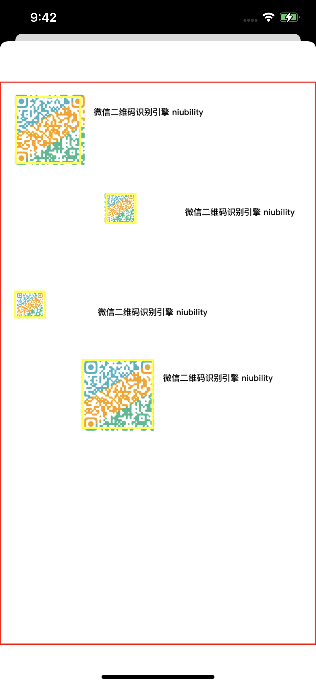

# WeChatQRCodeScanner

[](https://travis-ci.org/0x1306a94/WeChatQRCodeScanner)
[](https://cocoapods.org/pods/WeChatQRCodeScanner)
[](https://cocoapods.org/pods/WeChatQRCodeScanner)
[](https://cocoapods.org/pods/WeChatQRCodeScanner)

## Example

* 基本上每个App都有自己的扫码样式,所以本库并未在UI上细化实现
* [查看扫码识别示例](https://youtu.be/ORlSBrc5Dtk) 参考 [KKQRCodeScannerController](https://github.com/0x1306a94/WeChatQRCodeScanner/blob/master/Example/WeChatQRCodeScanner/KKQRCodeScannerController.m)
* 图片识别示例, 参考 [KKViewController](https://github.com/0x1306a94/WeChatQRCodeScanner/blob/master/Example/WeChatQRCodeScanner/KKViewController.m#L34)


## Requirements

## Installation

```ruby
pod 'WeChatQRCodeScanner'
```

## Author

0x1306a94, 0x1306a94@gmail.com

## License

WeChatQRCodeScanner is available under the MIT license. See the LICENSE file for more info.


